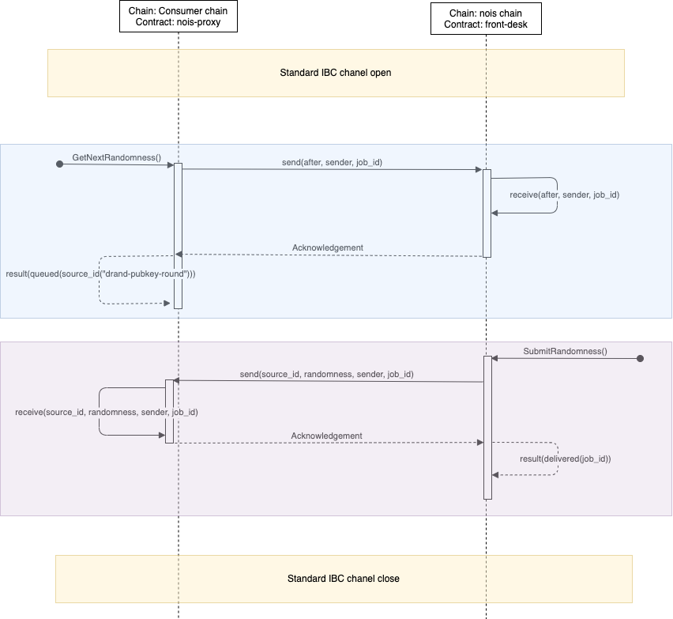

# Nois Contracts

This is the Nois IBC protocol section. It defines the structure of the packets
transiting between the nois-proxy sitting on the consumer chain and the nois
chain.

## Sequence diagram

